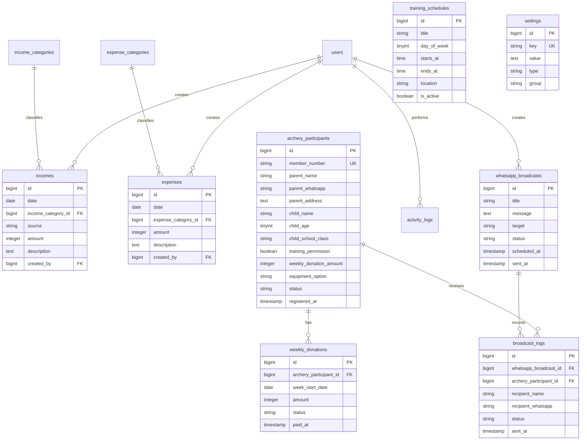

# ERD - Baitul Muttaqin Youth Management System

```mermaid
erDiagram
    users ||--o{ incomes : creates
    users ||--o{ expenses : creates
    users ||--o{ whatsapp_broadcasts : creates
    users ||--o{ activity_logs : performs

    archery_participants ||--o{ weekly_donations : has
    archery_participants ||--o{ broadcast_logs : receives

    income_categories ||--o{ incomes : classifies
    expense_categories ||--o{ expenses : classifies

    whatsapp_broadcasts ||--o{ broadcast_logs : records

    archery_participants {
        bigint id PK
        string member_number UK
        string parent_name
        string parent_whatsapp
        text parent_address
        string child_name
        tinyint child_age
        string child_school_class
        boolean training_permission
        integer weekly_donation_amount
        string equipment_option
        string status
        timestamp registered_at
    }

    weekly_donations {
        bigint id PK
        bigint archery_participant_id FK
        date week_start_date
        integer amount
        string status
        timestamp paid_at
    }

    incomes {
        bigint id PK
        date date
        bigint income_category_id FK
        string source
        integer amount
        text description
        bigint created_by FK
    }

    expenses {
        bigint id PK
        date date
        bigint expense_category_id FK
        integer amount
        text description
        bigint created_by FK
    }

    whatsapp_broadcasts {
        bigint id PK
        string title
        text message
        string target
        string status
        timestamp scheduled_at
        timestamp sent_at
    }

    broadcast_logs {
        bigint id PK
        bigint whatsapp_broadcast_id FK
        bigint archery_participant_id FK
        string recipient_name
        string recipient_whatsapp
        string status
        timestamp sent_at
    }

    training_schedules {
        bigint id PK
        string title
        tinyint day_of_week
        time starts_at
        time ends_at
        string location
        boolean is_active
    }

    settings {
        bigint id PK
        string key UK
        text value
        string type
        string group
    }
```
